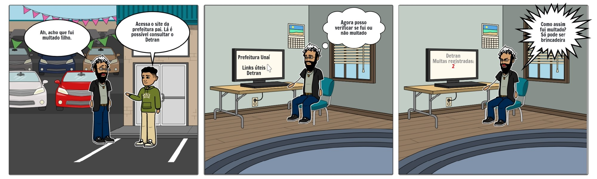

# StoryBoard

## 1. Introdução

Storyboard é um tipo de protótipação de baixa fidelidade, que consiste em uma série de
desenhos mostrando como um usuário pode progredir em uma tarefa. Tem como objetivo trazer uma pré-visualização do ambiente e das pessoas envolvidas, utilizando uma sequência de ilustrações. (ROGERS, et al.)

Dessa forma, será apresentado Storyboards de como um usuário pode progredir em uma tarefa utilizando o site da prefeitura de Unái. Storyboards estes, que foram criados através da ferramenta "storyboardthat".

## 2. Storyboard: Acessar o Detran através de links úteis

 O Storyboard (Figura 1) representa <b> como acontece </b> a tarefa de acessar o Detran. 

Figura 1: Storyboard como é a tarefa acessar o Detran 
Fonte: Autor

 O Storyboard (Figura 2) representa <b>como deveria acontecer</b> a tarefa de acessar o Detran. 

Figura 2: Storyboard como deveria ser a tarefa acessar o Detran 
Fonte: Autor

|   Atividade   |  Tarefa  |    Definição    |
| :---         |     :---:      |          :--- |
| <b>Preparo</b>   | Definição das personas envolvidas | Persona: Rômulo Judas |
|           | Definição do ambiente do Storyboard | Cotidiano |
|  | Definição da tarefa a ser realizada | Acessar o Detran como um link útil |
|<b>Sequência</b> |    Definição dos passos para realizar a tarefa|  1. Acessar "informações úteis" 2. Acessar "Links úteis" 3. Acessar "Detran Veículos"|
|            |  O que leva a pessoa a usar a funcionalidade | Consultar multas, infração, pontos na carteira, de forma direta pelo Site de Unaí |
|            |  Como a tarefa será ilustrada   | Rômulo Judas, por ter baixo conhecimento em tecnologia, pede ajuda para seu filho para fazer uma consulta de multas. Sendo assim, ele busca o site da prefeitura para acessar diretamente a área de consultas de multas do Detran do Estado.     |
|<b>Satisfação</b> | Motivação principal de quem utiliza a funcionalidade   | Acessar de maneira fácil o site do Detran do estado, para consultar multas e infrações pelo site da prefeitura de Unaí |
|             | Tarefas que precisam ser implementadas | Deve ser consertado o "link" que leva de forma direta para o site do Detran do estado, pelo site de Unaí |

Tabela 1: Tabela do storyboard Acessar o Detran. 
Fonte: Autor

## 2.1 Storyboard: 

## Versionamento

| Data | Versão |           Descrição             |    Autor    |
|:----:|:------:|:-------------------------------:|:-----------:|
|12/09 |1.0     |     Criação do Documento        | Victor Rayan |
|12/09 |2.0    |     Criação do Storyboard 2.1     | Victor Rayan |

## Referências

##### Livro: BARBOSA, S. D. J.; SILVA, B. S. Interação Humano-Computador. 1ª edição, Rio de Janeiro: Elsevier, 2010.
##### <a href="https://www.storyboardthat.com/pt">SITE: https://www.storyboardthat.com/pt</a>
