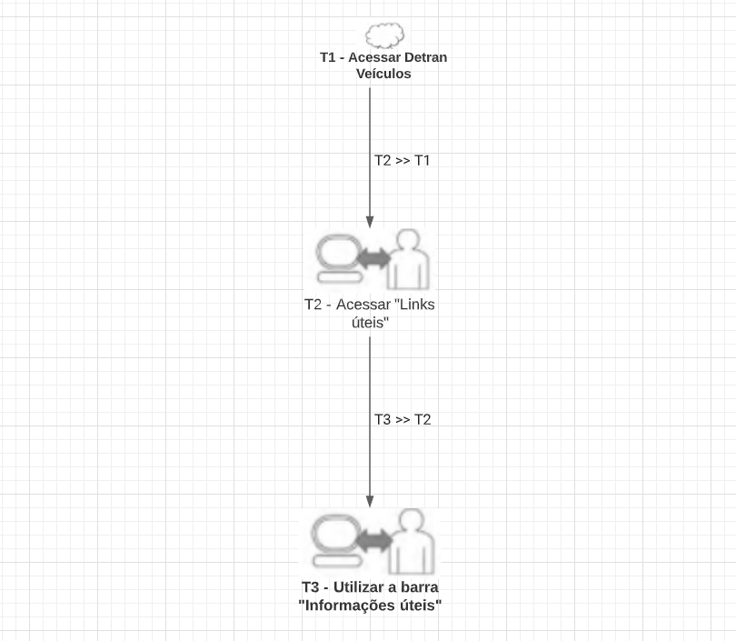

# Relato dos Resultados dos Storyboards

## 1. Objetivo

Executar o planejamento dos Storyboard, especificando o método de avaliação por inspeção utilizado e respondendo as perguntas propostas no documento de planejamento em busca de relatar os resultados consolidados dos Storyboards, esses Storyboards representam duas funcionalidades do site da Prefeitura de Unaí.

## 2. Metodologia

Utilizando o <b>percurso coginitivo</b>, será avaliado as funcionalidades através dos passos que é preciso percorrer até concluir a tarefa, identificando o quão fácil o sistema é em ser aprendido.

Os passos são definidos por perguntas, as quais são definidos pelo template da metodologia. Cada tarefa de uma funcionalidade deve responder as seguintes perguntas:

* 
P1. O usuário tentaria atingir o efeito correto?

* 
P2. O usuário perceberia que a ação correta está disponível?

* 
P3. O usuário conseguiria associar a ação correta com o efeito que está tentando atingir?

* 
P4. Se a ação correta for realizada, o usuário perceberia que está progredindo para concluir a tarefa?

## 3. Perfis de usuário e avaliadores

As personas criadas foram utilizadas como o perfil de usuário para avaliação. Rômulo que utiliza a funcionalidade do "Detran - Veículos", possui pouco conhecimento e dificuldade com ferramentas complexas. Julia, que executa a ferramenta de Guia do IPTU, possui experiência e necessita de uma ferramenta que lhe fornece mais velocidade de execução.

Os avaliadores utilizados foram Deivid Carvalho e Paulo Vitor. Ambos estudantes da FGA, que cursam a diciplina de IHC e que se colocaram nos lugares das personas.

## 4. Tarefas Analisadas

### 4.1 Detran - Veículo

Rômulo, que está na página inicial do site, precisa acessar o "Detran - veículo". Rapidamente poderia utilizar a barra de busca, porém possui dificuldades e necessita de uma busca por menu, até sua funcionalidade. A ideia é que até mesmo Rômulo possa utilizar a ferramenta, que possui bastante dificuldade com computadores, mas que está interessado a aprender a utilizar a funcionalidade.

<figure>

 
<figcaption></a>Figura 1, criado no LucidChart por Autor</figcaption>
</figure>

Foram utilizados 3 tarefas para concluir a funcionalidade demonstrada pela Figura 1, sendo elas cronologiacamente T3 (Utilizar a barra "informações úteis"), T2 (Acessar "Links úteis") e T1 (Acessar "Detran - Veículos").

<b>T3 - Informações Úteis</b>

<b>P1. O usuário tentaria atingir o efeito correto?</b>

-Não, pois o conceito de informações úteis não é conhecido.

<b>P2. O usuário perceberia que a ação correta está disponível?</b>

-Não, o assunto buscado está em uma outra aba dentro do menu procurado, não é trivial encontra-lo.

<b>P3. O usuário conseguiria associar a ação correta com o efeito que está tentando atingir?</b>

-Não, como o conceito de links úteis e informações úteis são amplos, não possuem objetividade em relação a procura do usuário.

<b>P4. Se a ação correta for realizada, o usuário perceberia que está progredindo para concluir a tarefa?</b>

-Não, provavelmente o usuário passaria diversas vezes sobre a aba certa, mas pelo identificador gerais como "informações úteis", poderia ter dúvidas se é realmente ali que encontrará o que procura (Dentran - Veículos).

<b>Sugestões de Solução</b>

Uma provavel solução é criar uma nova aba de menu chamada "Sites externos de Unaí". O site é utilizado muitas vezes como um intermediário a outro, então não é preciso esconder essa funcionalidade em 3 níveis de busca.

<b>T2 - Acessar "Links úteis"</b>

<b>P1. O usuário tentaria atingir o efeito correto?</b>

-Não, pois é esperado que o usuário conhece o termo "links", como estamos no Brasil, é uma linguagem que Rômulo não estaria ápito.

<b>P2. O usuário perceberia que a ação correta está disponível?</b>

-Não, não existe ligação entre Detran - Veículos e links úteis na cabeça do usuário.

<b>P3. O usuário conseguiria associar a ação correta com o efeito que está tentando atingir?</b>

-Não, como o conceito de links úteis é desconhecido, não possuem objetividade em relação a procura do usuário.

<b>P4. Se a ação correta for realizada, o usuário perceberia que está progredindo para concluir a tarefa?</b>

-Sim, Rômulo encontraria um hiperlink para o site desejado.

<b>Sugestões de Solução</b>

Utilizar palavras que possam ser entendidas até mesmo por leigos e que estejam em português, afinal o site é público e aberto a comunidade.

<b>T3 - Acessar "Detran - Veículos"</b>

<b>P1. O usuário tentaria atingir o efeito correto?</b>

-Sim, a página o induz a escolher uma das opções.

<b>P2. O usuário perceberia que a ação correta está disponível?</b>

-Sim, é possível verificar se existe ou não o que ele busca.

<b>P3. O usuário conseguiria associar a ação correta com o efeito que está tentando atingir?</b>

-Sim, basta acessar o link marcado em destaque com o nome que deseja acessar.

<b>P4. Se a ação correta for realizada, o usuário perceberia que está progredindo para concluir a tarefa?</b>

-Não, o redirecionamento ao site do detran está quebrado.

<b>Sugestões de Solução</b>

Manter o contato com o site do Detran e verificar sempre se o link disponibilizado está funcionando corretamente. 

<b>Respondendo as perguntas planejadas</b>

<b>Pergunta a ser respondida</b>: O site da prefeitura de Unaí permite buscar suas funcionalidades sem utilizar palavras-chave?

Sim, é preciso ter um certo conhecimento previamente, e como o foco é conseguir fazer uma busca sem experiência, a ferramenta acaba não cumprindo bem seu papel.

<b>Pergunta a ser respondida</b>: O site da prefeitura de Unaí permite o acesso ao site do Detran através do menu, utilizando os links úteis e clickando na referência "Detran Veículos - Multas/Auto/Infração".

Não, o link disponibilizado está quebrado, sendo necessário manter o contato com o site para sempre fornecer o link funcionando corretamente.

## 5. Referência Bibliográfica

Livro: Barbosa, S.D.J.; Silva, B.S.; Silveira, M.S.; Gasparini, I.; Darin, T.; Barbosa, G.D.J.
(2021) Interação Humano-Computador e Experiência do Usuário.

## 6. Versionamento
| Data |Versão|         Descrição          |       Autor      |
|:----:|:----:|:--------------------------:|:----------------:|
| 20/09/2021 |  1.0 | Criação da página    | Deivid Carvalho |

