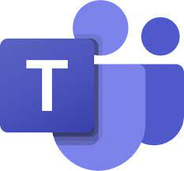

# Prefeitura de Unaí

## Sobre

Documentação disponível para o projeto que foi realizado na disciplina de **Interação Humano Computador**, ministrada na **Universidade de Brasília** (FGA) pelo professor **André Barros de Sales**.

## Integrantes da Equipe

<table>
    <tr>
        <th>Foto</th>
        <th>Nome</th>
        <th>GitHUB</th>
    </tr>
    <tr>
        <td>
            
        </td>
        <td style="padding-top: 50px;">
            Deivid Carvalho
        </td>
        <td style="padding-top: 50px;">
            <a href="https://github.com/deivid-a1" target="_blank">@deivid-a1</a>
        </td>
    </tr>
        <tr>
        <td>
            
        </td>
        <td style="padding-top: 50px;">
            Hugo Rocha
        </td>
        <td style="padding-top: 50px;">
            <a href="https://github.com/hugorochaffs" target="_blank">@hugorochaffs</a>
        </td>
    </tr>
    <tr>
        <td>
            
        </td>
        <td style="padding-top: 50px;">
            Irwin Schmitt
        </td>
        <td style="padding-top: 50px;">
            <a href="https://github.com/irwinschmitt" target="_blank">@irwinschmitt</a>
        </td>
    </tr>
        <tr>
        <td>
            
        </td>
        <td style="padding-top: 50px;">
            Lucas Lopes
        </td>
        <td style="padding-top: 50px;">
            <a href="https://github.com/LucasPLopes" target="_blank">@LucasPLopes</a>
        </td>
    </tr>
     <tr>
        <td>
            
        </td>
        <td style="padding-top: 50px;">
            Paulo Vitor
        </td>
        <td style="padding-top: 50px;">
            <a href="https://github.com/PauloAbiAcl" target="_blank">@PauloAbiAcl</a>
        </td>
    </tr>
    <tr>
        <td>
            
        </td>
        <td style="padding-top: 50px;">
           Victor Rayan
        </td>
        <td style="padding-top: 50px;">
            <a href="https://github.com/victor-rayan" target="_blank">@victor-rayan</a>
        </td>
    </tr>
</table>

## Ferramentas

<figure>

 
</figure>
GitHub é uma plataforma de hospedagem de código-fonte e arquivos com controle de versão usando o Git. Ele permite que programadores, utilitários ou qualquer usuário cadastrado na plataforma contribuam em projetos privados e/ou Open Source de qualquer lugar do mundo.

<figure>

 
</figure>
O Telegram é um serviço de mensagens instantâneas baseado na nuvem. O Telegram está disponível para smartphones ou tablets, computadores e também como Aplicação web. Os usuários podem fazer chamadas com vídeo, enviar mensagens e trocar fotos, vídeos, autocolantes e arquivos de qualquer tipo. 

<figure>

 
</figure>

Microsoft Teams é uma plataforma unificada de comunicação e colaboração que combina bate-papo, videoconferências, armazenamento de arquivos (incluindo colaboração em arquivos) e integração de aplicativos no local de trabalho. O serviço se integra ao pacote de produtividade Office 365 e apresenta extensões que podem ser integradas a produtos que não são da Microsoft.
<figure>

 
</figure>
Trello é um aplicativo de gerenciamento de projeto baseado na web originalmente feito por Fog Creek Software em 2011. Em 2014 tornou-se uma empresa. Ele opera um modelo de negócio Freemium.
<figure>

 
</figure>
Figma é um editor gráfico de vetor e prototipagem de projetos de design baseado principalmente no navegador web, com ferramentas offline adicionais para aplicações desktop para GNU/Linux, macOS e Windows. 

