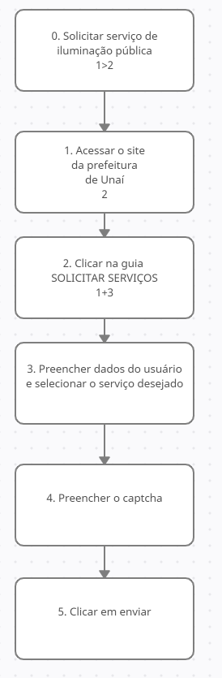

# Análise de tarefas

## Definição

Uma análise de tarefa se preocupa com a performance do
trabalho, e isso é o que a distingue de outras técnicas , como é realizado e por quê. Segundo
Diaper e Stanton é uma expressão utilizada para representar todos os métodos de coletar, classificar e
interpretar dados sobre o desempenho de um sistema que possua ao menos uma pessoa como
componente.(BARBOSA e SILVA, 2010) 

## Motivo da escolha

Essa técnica será adotada, pois ela fornece uma abordagem genérica para a investigação de problemas de IHC (Annet e Diaper, 2003). Além disso, porque ela facilita a ilustração de tarefas do sistema, separando-as em objetivos, subobjetivos e operações e os relacionando de diferentes maneiras em relação a como as tarefas devem ser executadas pelo usuário, demonstrando as possibilidades de inputs, ações, feedback e problemas que estão no contexto da ferramenta análisada.

## Análise Hierárquica de Tarefas (HTA – Hierarchical Task Analysis)

De acordo com Annet e Duncan, é um método de análise que busca entender como as
competências e habilidades exibidas em tarefas complexas e não repetitivas, também para
auxiliar na identificação de problemas de desempenho. 

## Resultados

A seguir estão apresentadas as análises das tarefas HTA:

<figure>

 
<figcaption>Figura 1 - Diagrama HTA solicitação de iluminação pública.</a></figcaption>
</figure>
        

## Referências Bibliográficas

Livro: Barbosa, S.D.J.; Silva, B.S.; Silveira, M.S.; Gasparini, I.; Darin, T.; Barbosa, G.D.J.
(2021) Interação Humano-Computador e Experiência do Usuário.

## Versionamento

| Data |Versão|         Descrição          |       Autor      |
|:----:|:----:|:--------------------------:|:----------------:|
| 26/08/2021 |  1.0 | Criação da página     | Victor |
| 27/08/2021 |  1.1 | Adicionando resultados     | Hugo|
| 27/08/2021 |  1.2 | Revisão     | Paulo|