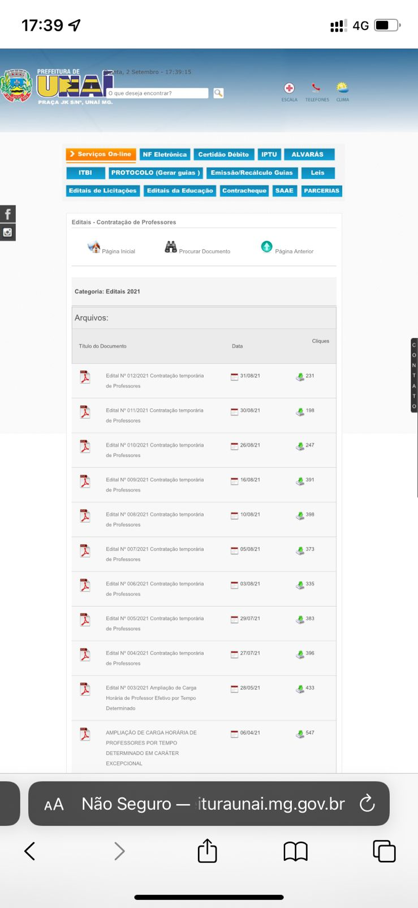

# Características da Plataforma

A aplicação desenvolvida pela Prefeitura de Unaí de do tipo Web Portal. O portal possui informações sobre a prefeitura e áreas para solicitação de serviços e documentos.

## Compatibilidade

A aplicação é compatível com os principais navegadores web do mercado do tipo desktop, foram testados os seguintes navegadores: Google Chrome, Safari e Firefox. O site não possui nenhuma adaptação para o mobile, o que torna o site extremamente difícil de ser acessado via dispositivos móveis, uma vez que sem adaptações, o site fica em uma versão de ícones e fontes pequenas. 

## Funcionalidades

O site apresenta diversas funcionalidades para os cidadãos do município como por exemplo:

* Emissão e consulta de nota fiscal de serviço eletrônica
* Emissão de certidão de débito
* Emissão e consulta de IPTU
* Emissão e consulta de alvarás
* Geração, emissão e recálculo de guias de protocolo
* Consulta de leis
* Consulta de editais de licitação e de educação
* Emissão de contracheques
* SAAE
* Consulta de parcerias
* Solicitação de serviços públicos

## Características Negativas

Quando tratamos de desempenho da interface, o site corresponde as expectativas em abiente desktop nos navegadores testados.
Já quando analisamos o desempenho da interface em ambiente mobile, o site apresenta-se extremamente ruim de ser utilizado, as fontes ficam extremamente pequenas e o clique em botões é uma tarefa difícil.

### Fotos de tela:

<figure>

 
</figure>

*Figura 1 - Página inicial da prefeitura em dispositivo móvel.*

<figure>

 
</figure>

*Figura 2 - Página de editais de educação em dispositivo móvel.*

## Referências Bibliográficas

Livro: Barbosa, S.D.J.; Silva, B.S.; Silveira, M.S.; Gasparini, I.; Darin, T.; Barbosa, G.D.J.
(2021) Interação Humano-Computador e Experiência do Usuário.

## Versionamento

| Data |Versão|         Descrição          |       Autor      |
|:----:|:----:|:--------------------------:|:----------------:|
| 02/09/2021 |  1.0 | Criação da página     | Hugo |
| 11/09/2021 |  1.1 | Adequações propostas pelo professor     | Hugo |
