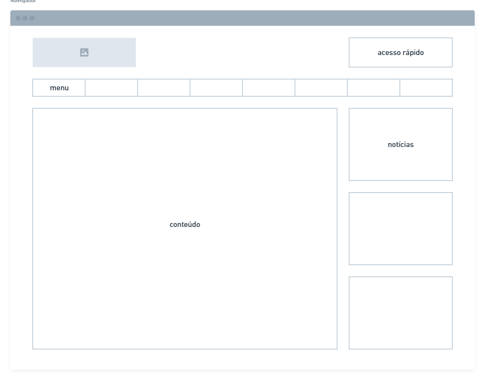
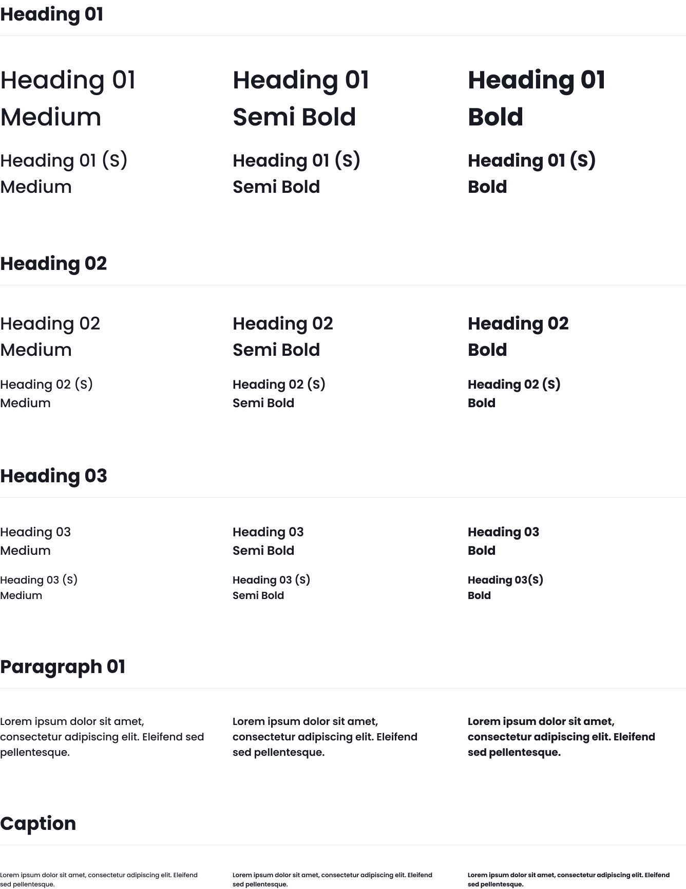
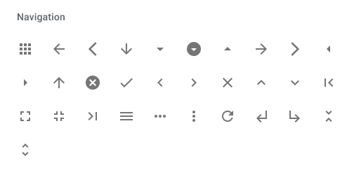
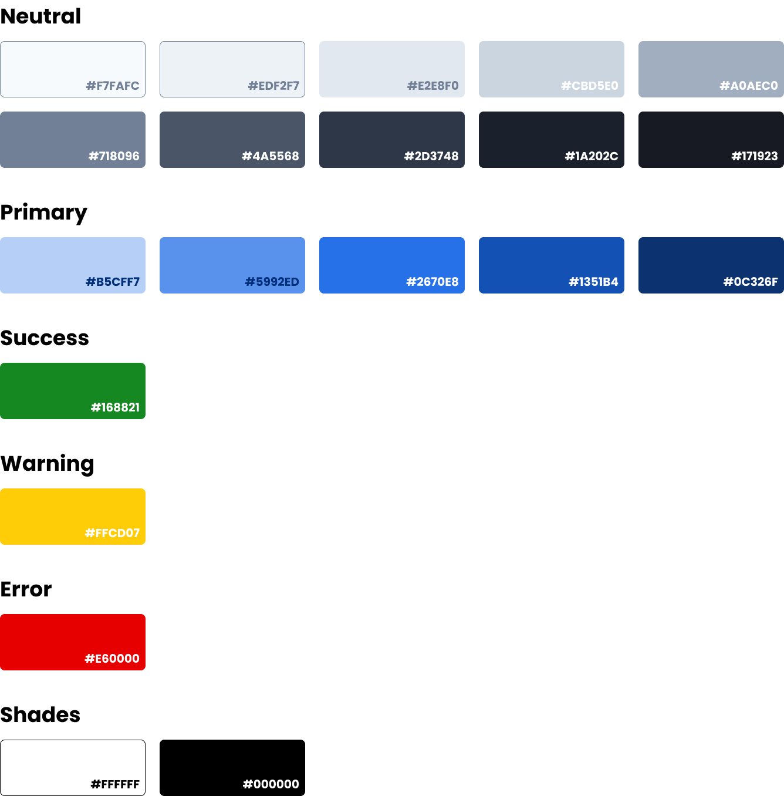
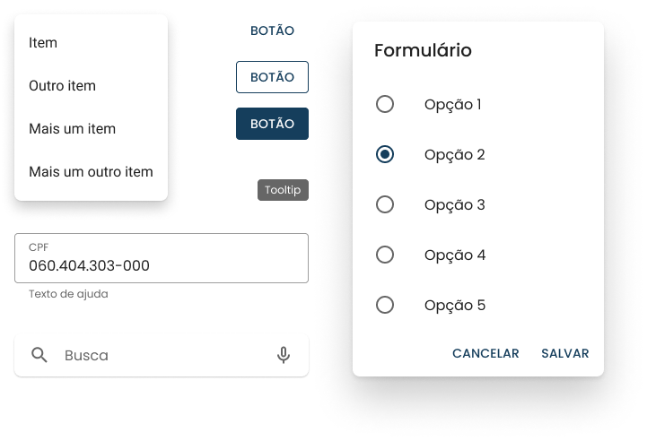

# Guia de Estilo

## Definição

Segundo Barbosa (2021), um guia de estilo é um documento que reúne os princípios e as diretrizes adotados em um projeto de forma que sejam efetivamente incorporados ao produto final.

Em nosso Guia de Estilo, definimos elementos que serão utilizados para a construção de todo o site, como layout, tipografia, símbolos, cores e componentes.

## Grid

A disposição dos elementos na interface será organizada através de um grid com 12 colunas.

<figure>
    
     
    <figcaption>
    Figura 1 - Sistema de grid com 12 colunas.
    </figcaption>
</figure>

## Layout

Seguindo o grid, o layout deve seguir o modelo com logotipo, acesso rápido, menu, conteúdo e notícias, como mostrado abaixo.

<figure>
    
     
    <figcaption>
    Figura 2 - Sistema de grid com 12 colunas.
    </figcaption>
</figure>

## Tipografia

Foi escolhida a fonte Poppins pois é utilizada em conjunto com o Material Design, um design system mais popular.

 

<figure>
    
     
    <figcaption>
    Figura 3 - Fonte Roboto. Disponível no <a href="https://fonts.google.com/specimen/Poppins.">link</a>.
    </figcaption>
</figure>

## Simbolismo

Seguindo o objetivo de criar algo padronizado para o usuário, foram escolhidos os ícones do Material Design.

 

<figure>
    
     
    <figcaption>
    Figura 4 - Material Icons. Disponível no <a href="https://fonts.google.com/icons">link</a>.
    </figcaption>
</figure>

## Cores

As cores foram escolhidas baseando-se nas cores já utilizadas no site, adicionando padrões de cores amplamente utilizados.

<figure>
    
     
    <figcaption>
    Figura 5 - Cores utilizadas.
    </figcaption>
</figure>

## Componentes

Os componentes foram pensados utilizando a tipografia, os símbolos e as cores previamente definidos.

<figure>
    
     
    <figcaption>
    Figura 8 - Componentes.
    </figcaption>
</figure>

## Referências Bibliográficas

Livro: Barbosa, S.D.J.; Silva, B.S.; Silveira, M.S.; Gasparini, I.; Darin, T.; Barbosa, G.D.J.
(2021) Interação Humano-Computador e Experiência do Usuário.

## Versionamento

|    Data    | Versão |                    Descrição                    |     Autor     |
| :--------: | :----: | :---------------------------------------------: | :-----------: |
| 04/09/2021 |  1.0   | Definição, grid, tipografia, simbolismo e cores | Irwin Schmitt |
| 08/09/2021 |  2.0   |          Layout, correções e melhorias          | Irwin Schmitt |
