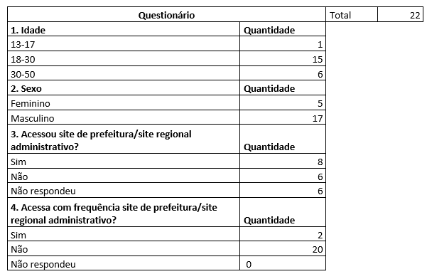

# Perfil de usuário

 Para definirmos o perfil do usuário, será utilizado uma simples pesquisa, que de acordo com Barbosa [1], para orientar a equipe da situação atual que envolve o usuário e o produto. A tal pesquisa, produzirá resultados que será utilizado ao longo do projeto, mas que não serão referências definitivas e tão pouco assertivas.

## Pesquisa

Para a pesquisa foi utilizado um questionário simples feito no Excel, de forma remota ou em forma de conversa. Pois em reunião, no dia 12/08/2021, com a equipe foi decido de tal forma. Utilizamos as seguintes perguntas:

<figure>

 
<figcaption>Figura 1 - Questionário, feito por Deivid.</a></figcaption>
</figure>

## Resultados

Baseado nos dados, fica claro que as pessoas que utilizam o site são de um nicho bem específico e o utilizam de forma não frequente. Com isto, o usuário sempre esquecerá as funcionalidades por utilizar uma vez ou outra.

        

Outra característica marcante é a idade, quem marcou que já utilizou a ferramenta, possuía em grande quantidade idades de 30-50 anos. Como a pesquisa foi feita em grande maioria em forma de conversa, foi identificado que a maioria que utilizava era pelo fato da pandemia atualmente, e outra pessoa por acompanhar a situação das escolas da cidade.

## Referências Bibliográficas

[1] Livro: Barbosa, S.D.J.; Silva, B.S.; Silveira, M.S.; Gasparini, I.; Darin, T.; Barbosa, G.D.J.
(2021) Interação Humano-Computador e Experiência do Usuário.

## Versionamento

| Data |Versão|         Descrição          |       Autor      |
|:----:|:----:|:--------------------------:|:----------------:|
| 26/08/2021 |  1.0 | Criação da página     | Deivid Carvalho |
