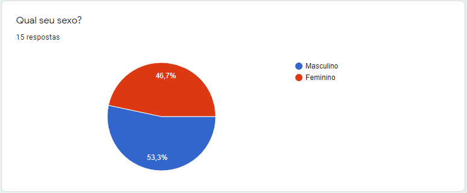
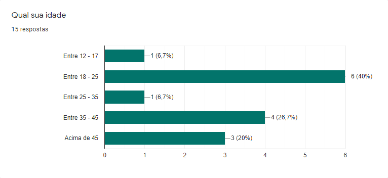
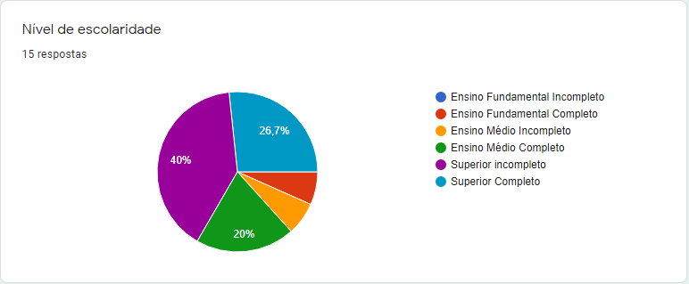
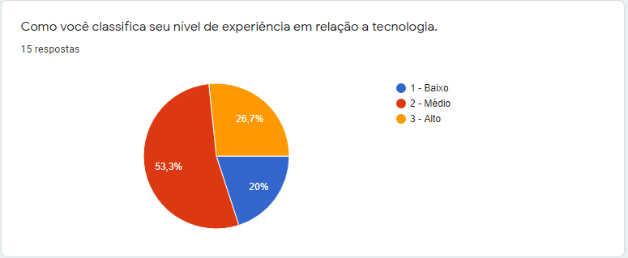
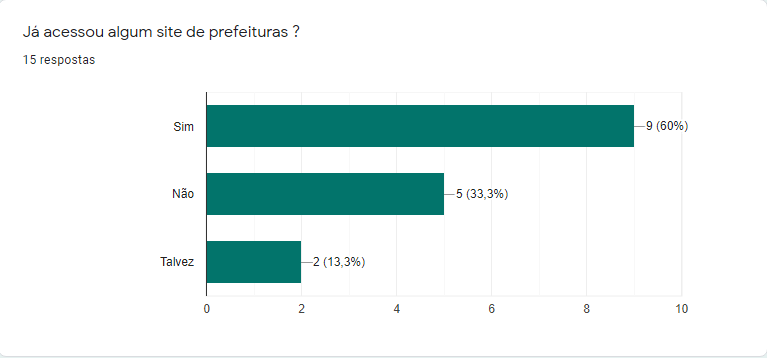
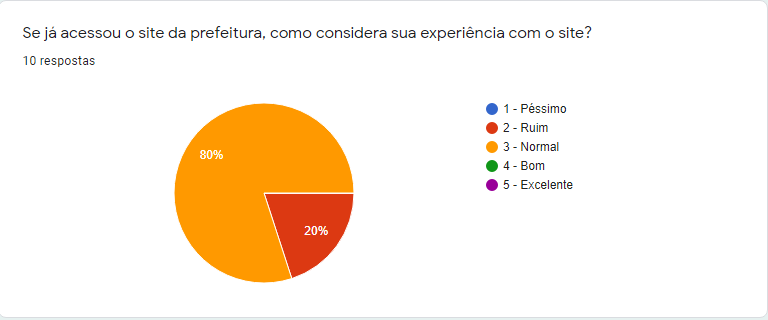
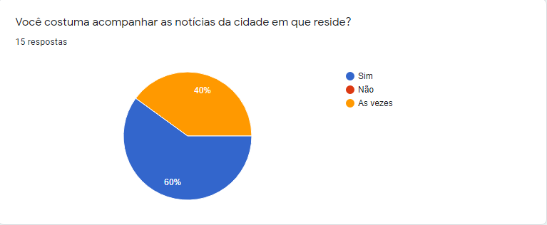
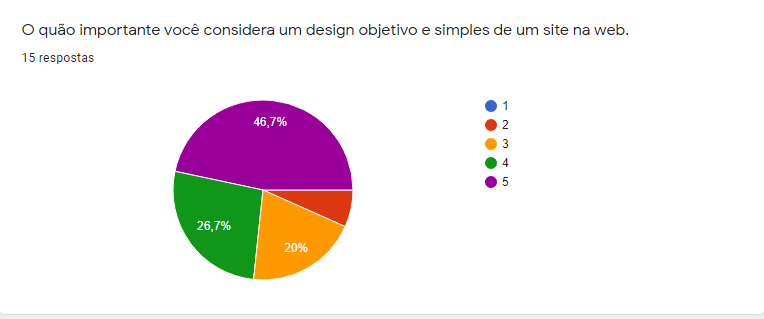
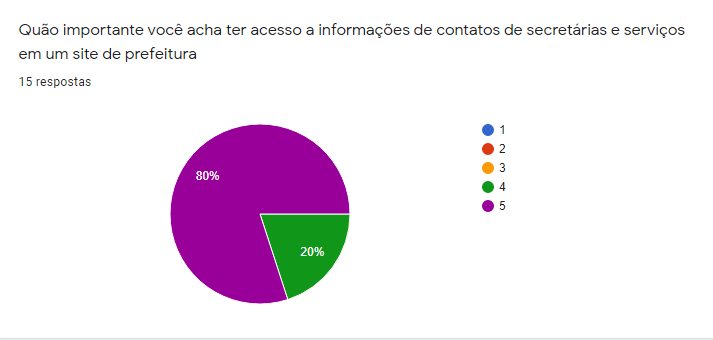
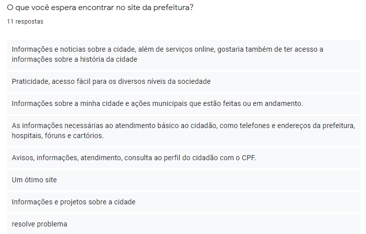

# Questionário

## Descrição 

Questionário é um instrumento de coleta de informação,onde são preenchidos os dados e informações. O questionário é frequentemente confundido com entrevista, teste, formulário, inquérito e escala. Dessa forma foi utilizado o formulário, para medir a satisfação e opinião dos usuários com relação à utilização dos sites de prefeituras Preece et alii (2005) e Silva & Barbosa (2021).

A seguir, o questionário feito através do Google Forms.Foi enviado para pessoas com características diferentes, com o objetivo de receber um resultado com opinões variadas e mais concreto. 

<figure>

<figcaption>Figura 1</a></figcaption>
</figure>

<figure>

<figcaption>Figura 2</a></figcaption>
</figure>

<figure>

<figcaption>Figura 3</a></figcaption>
</figure>

<figure>

<figcaption>Figura 4</a></figcaption>
</figure>

<figure>

<figcaption>Figura 5</a></figcaption>
</figure>

<figure>

<figcaption>Figura 6</a></figcaption>
</figure>

<figure>

<figcaption>Figura 7</a></figcaption>
</figure>

<figure>

<figcaption>Figura 8</a></figcaption>
</figure>

<figure>

<figcaption>Figura 9</a></figcaption>
</figure>

<figure>

<figcaption>Figura 10</a></figcaption>
</figure>

## Referências Bibliográficas
Livro: Barbosa, S.D.J.; Silva, B.S.; Silveira, M.S.; Gasparini, I.; Darin, T.; Barbosa, G.D.J.
(2021) Interação Humano-Computador e Experiência do Usuário.

## Versionamento

| Data |Versão|         Descrição          |       Autor      |
|:----:|:----:|:--------------------------:|:----------------:|
| 27/08/2021 |  2.0 | Criação da página     | Paulo Vitor, Victor |
