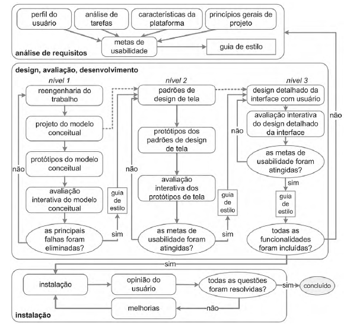

# Processo de Design

De acordo com Barbosa e Silva [1], o processo de design define as bases para todas as atividades de design, de forma iterativa.
Começando geralmente pela análise da situação atual, quando se tem o conhecimento suficiente sobre a situação, 
é adquirido também as necessidades e as oportunidades de melhorias. Logo após é usual criar uma proposta de intervenção da situação atual e com isto é preciso sintetizar a intervenção,
ou seja, conceber, modelar e construir, e caso necessário identificar uma nova situação e repetir o processo.

## Engenharia de usabilidade de Mayhew

Para isto, Deborah Mayhew (1999) desenvolveu uma técnica para a engenharia de usabilidade, 
utilizando 3 fases em ciclo com as bases do processo de design:

- 
<b>Análise de requisitos;</b>

- 
<b>Design, avaliação e desenvolvimento;</b>

- 
<b>Instalação.</b>

<figure>

 
<figcaption>Fig. 1 - Diagrama da Engenharia de usabilidade de Mayhew, retirado do livro feito por Barbosa [1].</a></figcaption>
</figure>

### Análise de requisitos:

Será definido as metas de usabilidades, com base no:

- 
<b>Perfil dos usuário;</b>

- 
<b>Análise das tarefas;</b>

- 
<b>Possibilidades e limitações da plataforma;:</b>

- 
<b>Princípios gerais de design de IHC.</b>

### Design, avaliação e desenvolvimento:

Será proposto uma solução de IHC com base nas metas de usabilidade determinadas nas análises de requisitos.
Aqui será utilizado 3 níveis de detalhes para projetar tal solução:

1. 
Nível de protótipo conceitual: Será repensada o trabalho do design aplicada no sítio, com o objetivo de
sanar o que o usuário precisa, elaborando alternativas de solução do modelo conceitual. Além disto será feito protótipos de baixa
fidelidade e avaliações dos protótipos.

2. 
Definir padrões de design de IHC com nível médio de fidelidade: Construir protótipos de média fidelidade,
padronizadas de acordo com o padrão definido e logo em seguida avalia-los.

3. 
Alta fidelidade: Criação do projeto em detalhes da interface, com alta fidelidade, para a implementação,
avaliada sempre pelo usuário.

### Instalação:

Após algum tempo de uso dos usuários, é preciso coletar opiniões dos usuários para melhorar o sistema em versões futuras,
ou se for o caso acusar a necessidade de desenvolver um novo sistema interativo ainda não previsto.

# Referências

1. 
Livro: BARBOSA, S. D. J.; SILVA, B. S.; SILVEIRA, M. S.; GASPARINI, I.; DARIN, T.; BARBOSA, G. D. J; INTERAÇÃO HUMANO-COMPUTADOR E EXPERIÊNCIA DO USUÁRIO, São Paulo, 2021.

## Versionamento

| Data |Versão|         Descrição          |       Autor      |
|:----:|:----:|:--------------------------:|:----------------:|
| 14/08/2021 |  1.0 | Criação da página     | Deivid Carvalho |
| |    |  |  |
| |    |  |  |
| |    |  |  |
