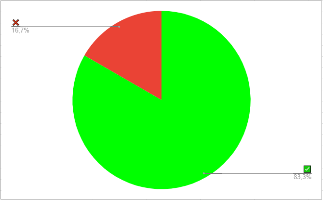

# Verificação - Análise de Requisitos - Análise de tarefas

## Dados do Documento

* Documento avaliado: Análise de Requisitos - Análise de tarefas

* Técnica de verificação: Inspeção

* Inspetor: Paulo

## Checklist

| Número | Questão | Resposta |
|:----:|:----:|:----:|
|1|O Documento possui versionamento?|✅|
|2|Está gramaticalmente correto?|❌|
|3|Os diagramas HTA estão de acordos com o livro Barbosa e Silva?|✅|
|4|Os tópicos correspondem com os conteúdos apresentados?|✅|
|5|Há uma explicação da análise hierarquica de tarefas?,CTT,KLM e CNM-Goms?|✅|

## Conclusão

Alguns erros foram encontrados no documento alguns, porém em relação ao contéudo está adequado.
 

 <!--

 <figcaption>Figura 1: Gráfico representando os critérios cumpridos ou não do cheklist. Fonte: Autor</figcaption>
-->

## Referências Bibliográficas

Livro: Barbosa, S.D.J.; Silva, B.S.; Silveira, M.S.; Gasparini, I.; Darin, T.; Barbosa, G.D.J.
(2021) Interação Humano-Computador e Experiência do Usuário.

Slide: Serrano, M.; Serrano, M. Requisitos - Aula 23.

## Versionamento

| Data |Versão|         Descrição          |       Autor      |
|:----:|:----:|:--------------------------:|:----------------:|
| 02/10/2021 |  1.0 | Criação da página     | Hugo |