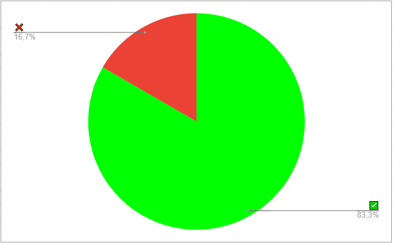

# Verificação - Análise de Requisitos - Metas de Usabilidade

## Dados do Documento

* Documento avaliado: Análise de Requisitos - Metas de Usabilidade

* Técnica de verificação: Inspeção

* Autor do documento: Deivid Carvalho

* Inspetor: Irwin

## Checklist

| Número | Questão | Resposta |
|:----:|:----:|:----:|
|1|O Documento possui versionamento?|✅|
|2|Está gramaticalmente correto?|❌|
|3|As Metas de Usabilidade estão de acordo com o conteúdo da bibliografia da disciplina de IHC?|✅|
|4|As Metas de Usabilidade abrangem os problemas encontrados no site escolhido em todas as metas?|❌|
|5|O documento apresenta as referências bibliográficas?|✅|
|7|As Metas de Usabilidade estão de acordo com o conteúdo da disciplina de IHC?|✅ |
|8|As perguntas Metas de Usabilidade estão descritas de forma clara e compreensiva?|✅ |

## Conclusão

O documento possui alguns erros ortográficos. Falta acrescentar de forma separada a análise da aplicação das metas.
 

 

 <figcaption>Figura 1: Gráfico representando os critérios cumpridos ou não do cheklist. Fonte: Autor</figcaption>

## Referências Bibliográficas

Slide: Serrano, M.; Serrano, M. Requisitos - Aula 23.

