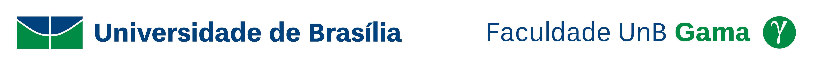

# Verificação dos Artefatos - Introdução

A verificação dos artefatos busca garantir o cumprimento de todos os requisitos elicitados. Tal etapa do projeto não depende de colaboração e conhecimento do P.O (Product Owner), sendo apenas para a equipe de desenvolvimento.

## Metodologia

Todos os documentos produzidos pela equipe serão divididos na medida do possível igualmente para todos os integrantes da equipe, de forma que o inspetor não seja o autor do documento para que não haja qualquer tipo de influência sobre a análise.

Para a verificação de todos os documentos, será utilizada a técnica de inspeção, que consiste em um checklist onde será verificado se os documentos estão de acordo com a notação do modelo e com o que se espera deles. Serão utilizados os simbolos de ✅ para os critérios atendidos e ❌ para os critérios não atendidos pelo documento.

Após a verificação dos artefatos, serão documentados os erros e acertos encontrados nos documentos por meio de gráficos e descrições textuais.

Ao final da documentação de erros e acertos, serão aplicadas as correções necessárias nos documentos.
 

## Referências Bibliográficas

Livro: Barbosa, S.D.J.; Silva, B.S.; Silveira, M.S.; Gasparini, I.; Darin, T.; Barbosa, G.D.J.
(2021) Interação Humano-Computador e Experiência do Usuário.

Slide: Serrano, M.; Serrano, M. Requisitos - Aula 23.

## Versionamento

| Data |Versão|         Descrição          |       Autor      |
|:----:|:----:|:--------------------------:|:----------------:|
| 30/09/2021 |  1.0 | Criação da página     | Hugo |
