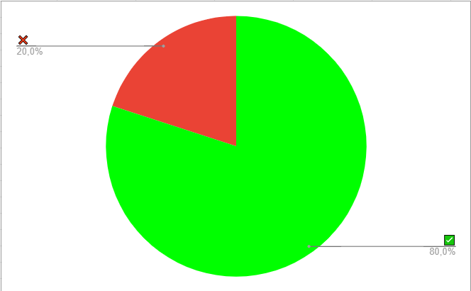

# Verificação - Planejamento - Sites Avaliados

## Dados do Documento

* Documento avaliado: Planejamento - Sites Avaliados

* Técnica de verificação: Inspeção

* Autor do documento: Deivid Carvalho

* Inspetor: Hugo Rocha

## Checklist

Checklist geral, podendo ser modificado na verificação do documento.
 

| Número | Questão | Resposta |
|:----:|:----:|:----:|
|1|O Documento possui versionamento?|✅|
|2|Está gramaticalmente correto?|✅|
|3|Os sites estão corretamente apresentados?|✅|
|4|Todas as imagens dos sites funcionam corretamente?|❌|
|5|As imagens possuem legendas?|✅|

## Conclusão

No geral o documento encontra-se muito bem escrito, há apenas uma imagem com linkagem "quebrada".
 

 
  

  <figcaption>Figura 1: Gráfico representando os critérios cumpridos ou não do cheklist. Fonte: Autor</figcaption>

## Referências Bibliográficas

Livro: Barbosa, S.D.J.; Silva, B.S.; Silveira, M.S.; Gasparini, I.; Darin, T.; Barbosa, G.D.J.
(2021) Interação Humano-Computador e Experiência do Usuário.

Slide: Serrano, M.; Serrano, M. Requisitos - Aula 23.

## Versionamento

| Data |Versão|         Descrição          |       Autor      |
|:----:|:----:|:--------------------------:|:----------------:|
| 02/10/2021 |  1.0 | Criação da página     | Hugo |
