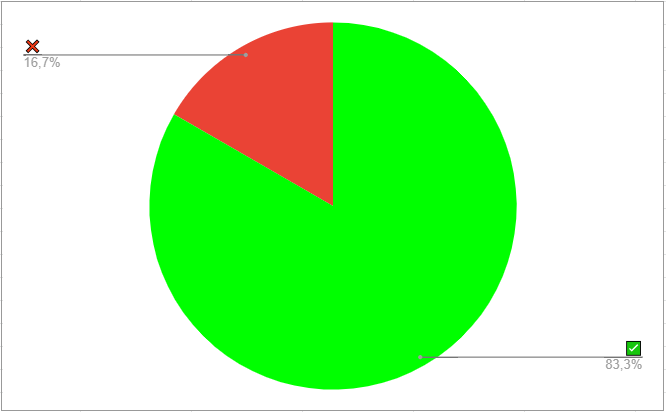

# Verificação - Design, avaliação e desenvolvimento - Storyboard

## Dados do Documento

* Documento avaliado: Design, avaliação e desenvolvimento - Storyboard

* Técnica de verificação: Inspeção

* Inspetor: Irwin

## Checklist

| Número | Questão | Resposta |
|:----:|:----:|:----:|
|1|O Documento possui versionamento?|✅|
|2|Está gramaticalmente sem erros?|❌|
|3|O storyboard condiz com a realidade ?|✅|
|4|O storyboard possui uma tabela com a as atividades da realização de cada tarefa?|✅|
|5|O documento apresenta as referências bibliográficas?|✅|
|6|O storyboard possui um planejamento|✅|
|7|Há uma explicação do que é Storyboard?|✅|

## Conclusão

O documento possui alguns erros ortográficos, porém está de acordo com o contéudo da disciplina.
 

 

 <figcaption>Figura 1: Gráfico representando os critérios cumpridos ou não do cheklist. Fonte: Autor</figcaption>

## Referências Bibliográficas

Livro: Barbosa, S.D.J.; Silva, B.S.; Silveira, M.S.; Gasparini, I.; Darin, T.; Barbosa, G.D.J.
(2021) Interação Humano-Computador e Experiência do Usuário.

Slide: Serrano, M.; Serrano, M. Requisitos - Aula 23.

## Versionamento
